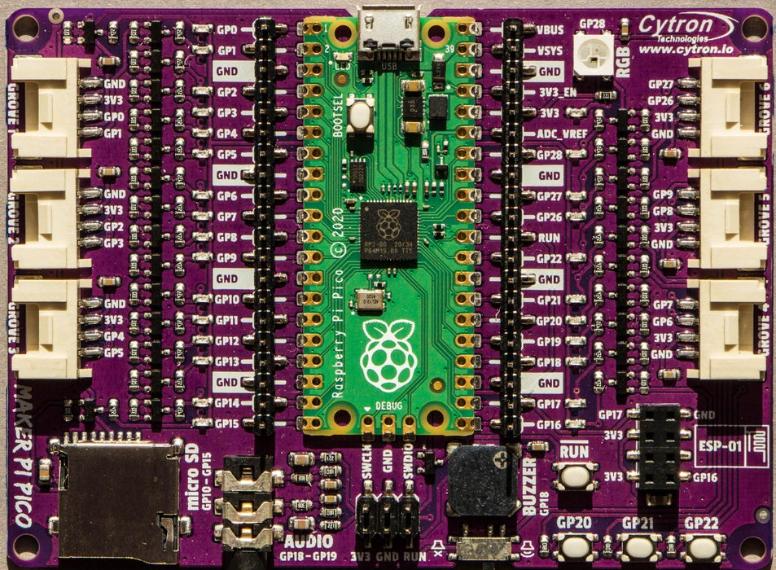
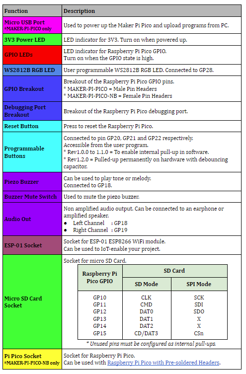
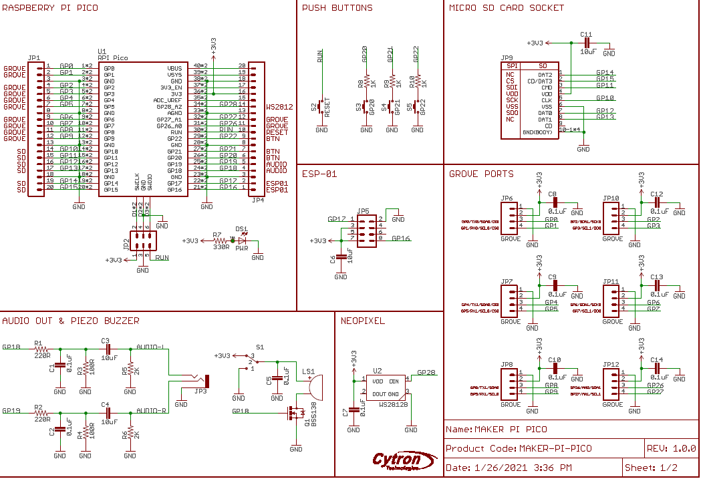

# Cytron Maker Pi Pico

[Cytron Maker Pico][] on Github

* RUN button to GND, missing from the bare Pico
* Clear labels on all the pins - much better than on a bare Pico - very useful
* Power indicator LED - green
* Blue LEDs on all the I/O pins
* Vertical male connector pins on all I/O pins
* 6 Grove Ports on pins GP0 to GP9 and ADC on pins GP27 and GP28
* A single Neopixel (WS2812B) RGB LED on pin GP28
* Momentary buttons on pins GP20, GP21 and GP22
* Piezo buzzer (with ON/OFF switch) on GP 18
* Audio output to headphone socket on pins GP18 and GP19
* Micro SD card reader on pins GP10 to GP15
* Port for connection of an ESP-01 WiFi module on GP 16 & GP17
* The DEBUG pins are brought out to male headers
* 3V3, GND and RUN are brought out to male headers
* The corners of the board are drilled for easy attachment to other
things

[Cytron Maker Pico]:https://github.com/CytronTechnologies/MAKER-PI-PICO

# Examples Tutorials

* [Cytron Maker Pico tutorial](https://tutorial.cytron.io/tag/raspberry-pi-pico/) Resources/Example code for
[Maker Pi Pico](https://www.cytron.io/p-maker-pi-pico) and
[Maker Pi Pico Base](https://www.cytron.io/p-maker-pi-pico-nb)
by Cytron Technologies.

* [Maker example code on Github][]

[Maker example code on Github]:https://github.com/CytronTechnologies/MAKER-PI-PICO/tree/main/Example%20Code/MicroPython

# Cytron Maker Pico Details

[Simplifying Raspberry Pi Pico](https://docs.google.com/document/d/1JoHsZk5IipQPCLXWbZYpDKjGlnkyACOJ1taUrKVsRg8/edit?usp=sharing)

## Details of Board

## Pin Reference

* For Grove 6,  normally for Analogue the Grove connector for the Grove Potentiometer is GP26

## Board Schema

